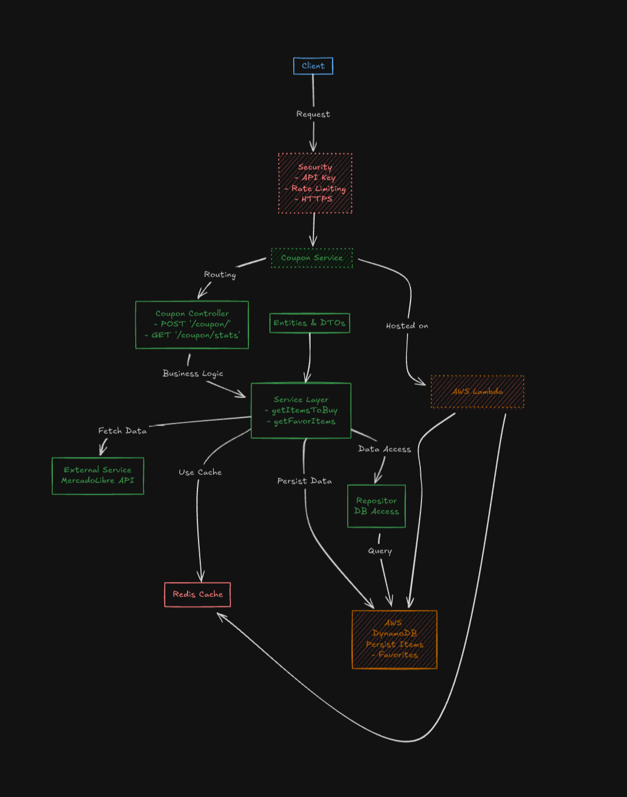

# Coupon Challenge - Mercado Libre

## Descripción
Este proyecto implementa una API REST para resolver el challenge solicitado por Mercado Libre. La API permite maximizar el uso de un cupón para la compra de ítems favoritos y gestionar un endpoint para obtener el top 5 de ítems más seleccionados.

## Despliegue en Producción
La API está desplegada en Render y se puede probar directamente desde el Swagger UI:
- **Swagger UI**: [Coupons-app](https://coupons-vjht.onrender.com/swagger-ui/index.html)

Nota: Desplegado en producción con datos simulados para favoritos y precios, pero preparado para integrarse con datos reales en el futuro

## Tecnologías utilizadas
- **Java 17**
- **Spring Boot 3.4.1**
- **Maven**
- **Docker**
- **Render** (para el despliegue en producción)

## Endpoints
### `/api/status`
- **Método**: GET
- **Descripción**: Verifica el estado de la aplicación.
- **Respuesta**: 
  ```json
  {
      "message": "Application is running!"
  }
  ```

### `/coupon`
- **Método**: POST
- **Descripción**: Calcula los ítems que pueden ser comprados con el cupón sin exceder su monto.
- **Datos simulados**: Los precios de los ítems están actualmente configurados en memoria, pero se pueden integrar con datos reales de una API o base de datos.

### `/coupon/stats`
- **Método**: GET
- **Descripción**: Devuelve el top 5 de ítems más seleccionados.
- **Datos simulados**: Los ítems favoritos están configurados en memoria, listos para integrarse con una base de datos.


## Requisitos previos
1. **Java 17**: Asegúrate de tener instalado Java 17.
2. **Docker**: Configurado en tu sistema.
3. **Maven**: Instalado para construir el proyecto localmente si no usas Docker.

## Decisiones técnicas y desafíos
1. **Datos simulados**:
Los precios y los favoritos están configurados como mocks para simplificar el desarrollo inicial.
La estructura permite integrar fácilmente una base de datos o una API en el futuro.

2. **OAuth con Mercado Libre**:
Intenté implementar el flujo de autorización para obtener datos reales, pero hubo problemas para generar el token debido a limitaciones de tiempo.

3. **Despliegue**:
Originalmente planeé usar AWS, pero opté por Render por su simplicidad y facilidad de configuración para este proyecto.

## Instalación y ejecución
### Opcion 1: Usando Docker
1. Construye la imagen Docker:
   ```bash
   docker build -t springboot-coupon .
   ```
2. Inicia el contenedor:
   ```bash
   docker run -p 8080:8080 springboot-coupon
   ```
3. Accede a la aplicación en [http://localhost:8080](http://localhost:8080).

### Opcion 2: Usando Docker Compose `(Recomendada)`
1. Inicia los servicios:
   ```bash
   docker-compose up
   ```
2. Accede a la aplicación en [http://localhost:8080](http://localhost:8080).

### Opcion 3: Ejecución local
1. Instala las dependencias:
   ```bash
   mvn clean install
   ```
2. Inicia la aplicación:
   ```bash
   mvn spring-boot:run
   ```

## Estructura del proyecto
```
src
├── main
│   ├── java
│   │   └── com.coupon.challenge
│   │       ├── config                # Configuraciones generales (Swagger, CORS, etc.)
│   │       ├── controller            # Controladores REST
│   │       ├── dto                   # Clases DTO para requests y responses
│   │       ├── exception             # Manejo de excepciones personalizadas
│   │       ├── interfaces            # Definición de interfaces
│   │       ├── service               # Lógica de negocio
│   └── resources
│       ├── application.properties    # Configuración principal
│       └── application-dev.properties # Configuración para desarrollo (opcional)
└── test
    ├── java        
```

### Descripción de las carpetas
- **`config`**: Configuración general de la aplicación (Swagger, CORS, etc.).
- **`controller`**: Controladores REST que gestionan las solicitudes HTTP.
- **`dto`**: Clases de transferencia de datos (requests/responses).
- **`exception`**: Manejo de excepciones personalizadas, como validaciones o errores de negocio.
- **`interfaces`**: Definición de interfaces, por ejemplo, para acceso a datos o servicios.
- **`service`**: Contiene la lógica de negocio principal.
- **`resources`**: Configuraciones como `application.properties`.
- **`test`**: Pruebas unitarias e integraciones.

## Archivos adjuntos
Este repositorio incluye los siguientes documentos relevantes:
1. [Challenge](./challenge.txt): Detalles completos del desafío planteado por Mercado Libre.
2. [Propuesta](./propuesta_desarrollo.txt): Documentación de la planificación inicial del proyecto.

## Diagramas
### Arquitectura inicial del sistema


## Próximos pasos
1. **Integrar datos reales**:
Conectar con la API de Mercado Libre para obtener precios y estadísticas de favoritos.
2. **Almacenamiento persistente**:
Usar una base de datos como DynamoDB o MongoDB para guardar favoritos y otros datos.
3. **Despliegue en AWS**:
Migrar el despliegue a AWS para aprovechar su escalabilidad y robustez.
4. **Optimización del rendimiento**:
Implementar caché con Redis para mejorar tiempos de respuesta.

## Autor
Leandro Cabello - [Linkedin](https://www.linkedin.com/in/leandroezequielcabello/)

---
Gracias por revisar este proyecto. ¡Espero tus comentarios! 🚀

